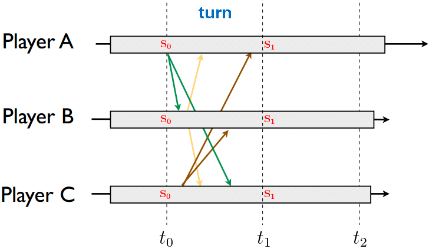

# 浅谈《无尽远征》战斗引擎（三）

这篇文章主要介绍《无尽远征》战斗引擎的具体实现方法。

我们根据游戏核心战斗的具体需求（参见前两篇系列文章）以及技术团队的整体实力，选择基于帧同步模型搭建战斗引擎的底层框架。

## 帧同步模型

### 基本原理

帧同步（Lockstep）模型又被称为锁步同步模型，最早被引入计算机软件领域是应用于计算机容错系统中。它的基本思想是，对于同一个软件系统，通过输入相同的操作一定能够得到相同的运算结果。第一代FPS游戏《Doom》首次将该模型引入游戏开发领域，用于在局域网对战中进行网络通讯，保证每个游戏程序的运算结果一致，从而给每一个玩家提供相同的游戏体验。

如上图所示，帧同步模型的游戏程序使用相同的时间周期（Turn）进行运算迭代。在某个时间周期内，游戏程序会向在同一局对战内的其他游戏程序发送玩家的操作指令；当到达时间周期的末尾时，所有游戏程序根据收到的所有玩家操作指令进行运算，改变游戏状态。这个过程贯穿一局对战的始终，直至游戏分出胜负而结束。这种P2P架构的帧同步模型在早期的局域网对战类游戏中应用广泛。

随着互联网的进化，游戏在朝着能够容纳更多人联机对战的方向发展，CS架构的帧同步模型也就应运而生了。如下图所示

在这种架构中，服务器端负责收集所有客户端的玩家操作输入，进行指令的时间排序仲裁，然后将结果广播给所有客户端。

### 常见问题

* 数值精度问题

  * 由于不同终端的CPU架构不同，它们对于浮点数运算的实现方式不同，导致相同的浮点数运算过程可能产生误差。如果游戏程序在运算过程中使用了浮点数运算（常见于物理引擎），那么在相同的玩家输入的情况下，计算结果可能是不同的，从而影响玩家的游戏体验。这种误差对于游戏的公平性和体验有较大影响，是不可接受的。

* 网络卡顿问题

  * 传统帧同步模型一般会采取如下策略来确保所有终端的计算结果相同：在某个时间周期（Turn）的末尾，游戏程序如果没有收到所有玩家的操作指令（包括空指令）则会暂停等待，直到收到所有玩家发来的当前时间周期指令。在网络状况不好的情况下，网络消息的延迟会造成游戏程序的卡顿，从而影响玩家的游戏体验。

* 断线重连问题

  * 在一局游戏的过程中，玩家的游戏程序的网络链接可能会发生异常而断开（时间点T0）。在等待重新连接到服务器的过程中，因为缺少其他玩家的输入，游戏程序是无法继续进行运算的。当游戏程序重新连接到服务器时（时间点T1），T0到T1这段时间内的玩家输入指令是丢失的。此时，游戏程序为了恢复到当前时间点的游戏对局状态，需要根据缺失的这部分玩家输入重新进行运算，而不能立刻恢复。这部分运算会消耗玩家终端的运算资源，对玩家的游戏体验造成影响。

## 实现方式

在编程语言方面，我们选择使用C++和Lua两种语言，其中C++用来编写战斗引擎主体框架逻辑，Lua用来编写技能和Buff中需要给战斗策划进行自定义扩展的功能。游戏客户端和战斗服务器使用同一套战斗引擎代码，来保证帧同步模型的运算一致性。在平衡了性能和战斗表现两者之后，我们选择将战斗引擎的运算步进时间周期（Turn）确定为50ms，即战斗引擎的逻辑帧率为20帧/秒。

### 优化方案

针对帧同步模型的上述问题，我们也在战斗引擎实现的过程中提出了相应的解决方案。

为了解决浮点数运算的数值精度问题，战斗引擎中的数据运算基本上使用整数（int32）进行。2D横版的战斗形式复杂度不高，我们没有使用第三方物理引擎，碰撞检测等物理引擎相关功能完全在战斗引擎内部实现。在确实需要进行小数运算的地方，运算过程中使用双精度浮点数（double）进行，运算结果还是以整数保存。在需要使用到百分比的地方（如概率运算），百分比都扩展为万分比对应的分子数值来表示。所有的战斗相关的策划配置文件中都以整数的形式进行配置。

为了解决网络卡顿时的玩家体验问题，客户端程序的战斗引擎逻辑不会进行“等停”。无论是否在当前时间周期内是否收到服务器发送来的操作指令，战斗引擎逻辑都会继续向后推演。如果在Tn时收到了服务器发送的更早时间的Tm周期的操作指令（m < n），那么客户端就会回溯到Tm周期重新开始运算。为了能够进行回溯操作，客户端需要保存上一次收到操作指令（Ta周期）后的所有时间周期的状态，直到下一次收到确定的操作指令（Tb周期）。此时，Tb周期的之前的状态数据都可以被丢弃了。

断线重连的等待问题没有特别好的解决方案，我们在运算追赶速度和画面表现的平滑过度之间取了一个平衡点，达到了游戏体验上的最低要求。

### 概念抽象

* 战斗核心 BattleCore： 战斗引擎实例，驱动逻辑随时间演进

* 状态 State：当前逻辑帧所有单位实例及引擎状态的合集，引擎逻辑演进的结果

* 实体 Entity： 战斗引擎中的所有物体的基类

* 单位 Unit：战斗中可以释放技能的实体，继承Entity

* 投掷物（弹道） Projectile： 战斗中飞行的子弹，是特定伤害的载体，继承Entity

* 技能 Skill： 某个技能的具体实现

* Buff： 某种有生命周期的单位状态的载体

### 有限状态机（Finite-State Machine, FSM）

战斗引擎中使用了有限状态机来组织运算过程。有限状态机是一种计算模型，它拥有有限数量的状态，每个状态可以迁移到零个或多个状态，输入指令决定执行哪个状态的迁移。具体来说，战斗过程中战斗单位和其技能的生命周期，通过有限状态机来表达。

* 单位状态机如下图所示。

* 每个战斗单位总共包含5个战斗状态，分别是初始化（Start）、待机（Idle）、移动（Move）、释放技能（Skill）、被控制（Restricted），每个状态间通过接收玩家操作指令和引擎逻辑指令实现状态切换。

* 技能状态机比较复杂，如下面两张图所示。

* 技能的状态包括就绪（Ready）、部署中（Deploy）、可实施（Applicable）、吟唱（Chant）、位移（Track）、前摇（Prepare）、中摇（Release）、引导（Channelling）、后摇（ReleaseFinish）、受限（Restriction）、恢复（Recover）、结束（Done）、冷却（CD）。技能可进行嵌套，主技能释放过程中可能包含多个子技能的释放过程。

* 战斗核心管理逻辑帧的状态序列，每个逻辑帧的状态管理所有的单位，每个单位管理各自的技能。时间的推进和玩家的操作输入这两者共同驱动整个战斗引擎的演算，单位和技能状态机共同决定了战斗引擎的基础规则。

### 数据驱动

战斗引擎所需的数据分为两个部分，一个是战斗单位的属性数据，一个是战斗单位的技能配置数据。

单位的属性数据由游戏逻辑服负责提供，在战斗开始时发送给客户端（单机战斗）或战斗服（联机战斗），用来初始化单位实例。

战斗单位的技能配置是由策划提供的静态配置数据，用来初始化技能和Buff实例。在具体实践中，我们选择了通过Excel编辑然后导出为json文件的方式供战斗引擎加载使用。此外，技能配置数据还包括了策划自定义的技能逻辑脚本，我们选择使用Lua语言编写这些脚本。战斗引擎提供了一系列可编程接口方法供战斗策划进行技能逻辑控制。

